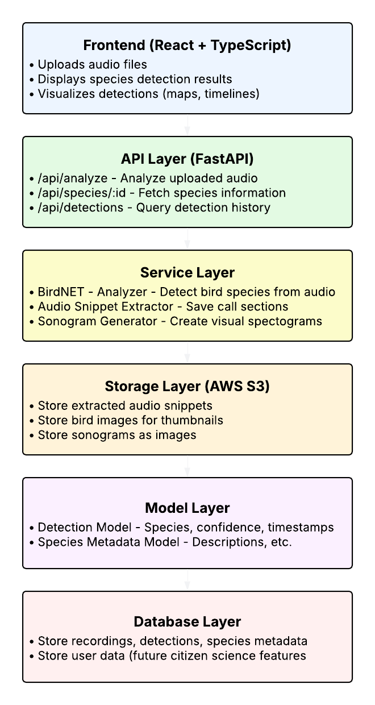

# SoundBird

**SoundBird** is a full-stack web application for analyzing bird audio recordings, detecting species, visualizing biodiversity patterns, and sharing discoveries.

Built for researchers, conservationists, and nature enthusiasts, SoundBird enables users to upload field recordings (e.g., from devices like AudioMoth), automatically detect bird species using machine learning models like BirdNET, and explore the results through an interactive frontend.  
The system highlights species presence across time and location, generates AI-assisted species thumbnails, and flags endangered or at-risk species based on detections.
It transforms raw acoustic data into dynamic visualizations, species profiles, and conservation insights — making bioacoustics research more accessible, engaging, and actionable.

SoundBird is currently under active development. It will allow users to:

- Upload and analyze recordings from field devices
- Detect bird species using BirdNET
- Generate AI-assisted photorealistic species thumbnails and summaries
- Visualize biodiversity trends across time and space
- Explore trends, hotspots, and potential conservation insights

## Current Features

- **Audio Analysis with BirdNET**: Detects bird species automatically from uploaded `.wav` recordings using BirdNET.
- **Dynamic Species Thumbnail Generation**: Uses generative AI to create realistic species thumbnails based on real bird traits, enriching species profiles.
- **Wikipedia Species Descriptions**: Fetches detailed descriptions to enrich detection results.
- **Automated Data Pipeline**: Processes large batches of field recordings into structured outputs, saving results as `.csv` and `.json`.
- **Scalable Web Architecture**: Designed to grow into a cloud-based platform with map-based exploration, detection timelines, habitat overlays, and more.

---

## System Architecture Overview

SoundBird is currently under active development.  
The following system diagrams reflect the **planned system architecture** and current **audio upload flow**.

### Planned System Architecture

<p align="center">
  
</p>

---

### Audio Upload Flow

_This diagram shows the step-by-step flow when a user uploads an audio file for species detection:_


---

## Installation

1. **Clone the repository:**

```bash
git clone https://github.com/your-username/soundbird.git
cd soundbird
```

2. **Set up your virtual environment:**

```bash
python -m venv venv
source venv/bin/activate  # On Windows use venv\Scripts\activate
```

3. **Install project dependencies:**

```bash
pip install -r requirements.txt
```

4. **Set your environment variables:**

Create a `.env` file in the root folder:

```bash
OPENAI_API_KEY=your-openai-api-key-here
```

## Usage

### Analyze Audio Files

Run batch analysis of your `.wav` recordings (requires BirdNET models installed):

```bash
python scripts/run_audio_analysis.py
```

This will analyze all `.wav` files inside the `./recordings/YYYYMMDD/` folder and output detection results to `./outputs/`.

### Generate Bird Thumbnail (Developer Testing)

This was primarily used to test thumbnail generation. It will be integrated into the web app pipeline in production.

```bash
python src/generate_thumbnail.py "American Goldfinch"
```

## Requirements

- Python 3.10 or 3.11
- Packages listed in `requirements.txt`
- OpenAI API key for DALL-E 3

## Future Work

**SoundBird** is under active development, with the following planned enhancements:

- **Biodiversity Comparison Tools**  
  Analyze and compare bird biodiversity levels between different habitats (e.g., old-growth forests vs second-growth) by overlaying spatial data such as GeoJSON habitat boundaries with recording locations.

- **Conservation Alerts**  
  Implement an alert system to flag the detection of endangered or species-at-risk in uploaded recordings, based on conservation status databases.

- **Historical and Seasonal Trends**  
  Expand functionality to track changes in species presence over time (e.g., year-over-year or seasonal migration patterns).

- **Enhanced Frontend Visualization**  
  Integrate map-based exploration, detection timelines, habitat overlays, and rich species profiles, making biodiversity data more intuitive and accessible.

- **Scalable Cloud Processing**  
  Expand infrastructure to handle large recording datasets and support collaborative research projects.

- **Community Sharing and Storytelling**  
  Allow users to share notable detections, species highlights, and field reports directly through the platform.

## About the Developer

This project is part of an independent R&D initiative focused on combining bioacoustics, machine learning, and generative AI to make biodiversity research more accessible and inspiring.
SoundBird is developed and maintained by Austen Sorochak — a software developer, environmental scientist, and nature enthusiast passionate about connecting technology with the living world.

## Acknowledgements

SoundBird uses the following open-source tools and models:

- [birdnetlib](https://github.com/kahst/birdnetlib) — a Python wrapper for BirdNET-Analyzer, licensed under the Apache License 2.0.
- [BirdNET-Analyzer](https://github.com/kahst/BirdNET-Analyzer) — the underlying species detection engine, source code licensed under the MIT License.
- BirdNET-Analyzer pre-trained models — provided for research and educational use under the [Creative Commons Attribution-NonCommercial-ShareAlike 4.0 License (CC BY-NC-SA 4.0)](https://creativecommons.org/licenses/by-nc-sa/4.0/).

We gratefully acknowledge the BirdNET project's contributions to bioacoustic research and open science.

## License

This project is licensed under the MIT License.
