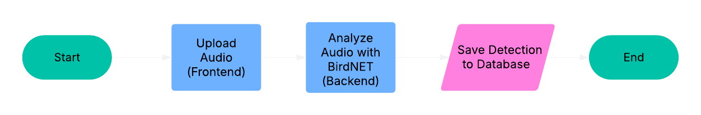

# SoundBird

**SoundBird** is a full-stack web application for analyzing bird audio recordings, detecting species, visualizing biodiversity patterns, and sharing discoveries.

Built for researchers, conservationists, and nature enthusiasts, SoundBird enables users to upload field recordings (e.g., from devices like [AudioMoth](https://www.openacousticdevices.info/audiomoth)), automatically detect bird species using machine learning models like BirdNET, and explore the results through an interactive frontend.  
The system highlights species presence across time and location, generates AI-assisted species thumbnails, and flags endangered or at-risk species based on detections.
It transforms raw acoustic data into dynamic visualizations, species profiles, and conservation insights — making bioacoustics research more accessible, engaging, and actionable.

SoundBird is currently under active development. It will allow users to:

- Upload and analyze recordings from field devices
- Detect bird species using BirdNET
- Generate AI-assisted photorealistic species thumbnails and summaries
- Visualize biodiversity trends across time and space
- Explore trends, hotspots, and potential conservation insights

## Current Features

- **Bird Species Detection**: Analyze `.wav` or `.zip` field recordings with BirdNET to detect bird calls.
- **PostgreSQL Persistence**: Save detections with timestamps, species info, and model confidence scores.
- **Normalized Data Model**: Link detections to recordings with status tracking (`PENDING`, `COMPLETED`, etc.).
- **Modular Web Architecture**: Built with FastAPI, SQLAlchemy, and a repository pattern for clean backend design.
- **AI-Generated Species Thumbnails**: Use DALL·E 3 to generate realistic images based on bird traits.
- **Wikipedia Integration**: Enrich detections with species descriptions fetched from Wikipedia.

---

## Tech Stack and Justification

| Technology         | Purpose                     | Why It’s Used                                                         |
| ------------------ | --------------------------- | --------------------------------------------------------------------- |
| **FastAPI**        | Web framework               | Lightweight, async-ready, and ideal for API-centric applications      |
| **SQLAlchemy**     | ORM for database access     | Clean and declarative way to model data using Python classes          |
| **Alembic**        | Database migrations         | Enables version-controlled schema changes                             |
| **PostgreSQL**     | Relational database         | Reliable, scalable, and feature-rich SQL database for structured data |
| **Docker Compose** | Dev environment management  | Simplifies provisioning of PostgreSQL in local development            |
| **BirdNETlib**     | ML model for bird detection | Provides local, pre-trained species detection from `.wav` files       |
| **OpenAI API**     | Image generation            | Generates species thumbnails using natural language prompts           |
| **Pydantic**       | Data validation             | Validates and serializes request and response data in FastAPI         |
| **python-dotenv**  | Env variable loading        | Keeps secrets and config out of source code, loaded from `.env` file  |

---

## High-Level System Data Flow

1. User submits a `.wav` or `.zip` file via the `POST /analyze` route.
2. `routes/analyze.py` receives the file and passes it to `analyze_audio_file()` in `services/audio_analyzer.py`.
3. `services/audio_analyzer.py` uses BirdNET to analyze audio, enriches detections, and calls the `DetectionRepository` to persist results.
4. `repositories/detection.py` handles database access and inserts detection records via SQLAlchemy ORM.
5. `models/detection.py` defines the DB schema (tables and columns).
6. `schemas/detection.py` defines Pydantic schemas for validation and serialization.
7. User can fetch stored detections through `GET /detections` and related CRUD endpoints in `routes/detections.py`.

---

# Data Model

SoundBird uses a normalized schema with two main tables: `recordings` and `detections`.

### Table: `recordings`

| Column               | Type     | Description                                       |
| -------------------- | -------- | ------------------------------------------------- |
| `id`                 | Integer  | Primary key                                       |
| `file_name`          | String   | Name of the uploaded audio file                   |
| `status`             | Enum     | Processing status (`PENDING`, `PROCESSING`, etc.) |
| `lat`                | Float    | Latitude of recording                             |
| `lon`                | Float    | Longitude of recording                            |
| `recording_datetime` | DateTime | Start time of the recording                       |
| `created_at`         | DateTime | Time recording was uploaded                       |
| `completed_at`       | DateTime | Time analysis finished                            |
| `error_message`      | String   | Optional error message if processing failed       |

### Table: `detections`

| Column            | Type     | Description                             |
| ----------------- | -------- | --------------------------------------- |
| `id`              | Integer  | Primary key                             |
| `recording_id`    | Integer  | Foreign key referencing `recordings.id` |
| `detection_time`  | DateTime | Timestamp of detected bird call         |
| `species`         | String   | Common species name                     |
| `scientific_name` | String   | Scientific name                         |
| `confidence`      | Float    | Model confidence score                  |
| `start_sec`       | Float    | Start of call (in seconds)              |
| `end_sec`         | Float    | End of call (in seconds)                |
| `created_at`      | DateTime | Timestamp when detection was recorded   |

---

## Module Descriptions

### `main.py`

**Purpose**: Main FastAPI entry point.

**Responsibilities**:

- Instantiates the FastAPI app
- Sets up health check and middleware
- Includes route routers (`/analyze`, `/detections`)
- Optionally sets up shared app state (e.g., BirdNET Analyzer instance)

---

### `routes/detections.py`

**Purpose**: Exposes CRUD endpoints for detection records.

**Responsibilities**:

- Define RESTful endpoints: `GET /detections`, `GET /detections/{id}`, `DELETE /detections/{id}`
- Delegate business logic to `DetectionRepository`
- Serialize responses using Pydantic schemas

---

### `routes/analyze.py`

**Purpose**: Handles audio upload and analysis.

**Responsibilities**:

- Accept `.wav` or `.zip` uploads via `POST /analyze`
- Extract metadata (lat/lon)
- Call `analyze_audio_file()` in `services/audio_analyzer.py`
- Return success or error response

---

### `schemas/detection.py`

**Purpose**: Defines request and response shapes using Pydantic.

**Responsibilities**:

- `DetectionCreate`: incoming payload for new detections
- `Detection`: response model (matches DB schema + ID)
- Enables type-checking, validation, and Swagger docs

---

### `models/detection.py`

**Purpose**: SQLAlchemy model for the `detections` table.

**Responsibilities**:

- Define database schema (columns, types, constraints)
- Maps to a table in PostgreSQL
- Used by repository layer for ORM operations

---

### `repositories/detection.py`

**Purpose**: Implements database access using the Repository pattern.

**Responsibilities**:

- `save_detections()`: bulk insert detection records
- `get_detection()`, `get_detections()`, `delete_detection()`
- Keeps DB logic decoupled from route and service layers

---

### `services/audio_analyzer.py`

**Purpose**: Orchestrates audio analysis using BirdNET and handles detection parsing.

**Responsibilities**:

- Accept a `.wav` file or directory of files
- Use BirdNETlib to extract detection data
- Parse and enrich metadata (datetime, lat/lon, filename)
- Delegate persistence to `DetectionRepository`

## System Architecture Overview

SoundBird is currently under active development.  
The following system diagrams reflect the **planned system architecture** and current **audio upload flow**.

### Planned System Architecture

<p align="center">
  
</p>

---

### Audio Upload Flow

_This diagram shows the step-by-step flow when a user uploads an audio file for species detection:_



---

## Installation

1. **Clone the repository:**

```bash
git clone https://github.com/your-username/soundbird.git
cd soundbird
```

2. **Set up your virtual environment:**

```bash
python -m venv venv
source venv/bin/activate  # On Windows use venv\Scripts\activate
```

3. **Install project dependencies:**

```bash
pip install -r requirements.txt
```

4. **Set your environment variables:**

Create a `.env` file in the root folder:

```bash
OPENAI_API_KEY=your-openai-api-key-here
```

---

## Database Setup (PostgreSQL + Alembic)

SoundBird uses PostgreSQL as its database and Alembic for schema migrations.

➡️ See [`database/README.md`](database/README.md) for full setup and migration instructions.

## Usage

### Start the Server

Ensure your PostgreSQL database is running, then start the FastAPI server:

```bash
uvicorn backend.app.main:app --reload
```

The app will be available at http://localhost:8000.

## Analyze Audio via API

> **Note:** `.wav` file names must follow the format `YYYYMMDD_HHMMSS.wav`  
> (e.g., `20250425_073000.wav`) in order to be processed correctly.

You can upload a `.wav` or `.zip` file for analysis using a `curl` command:

```bash
curl -X POST "http://localhost:8000/api/analyze" \
  -H "accept: application/json" \
  -H "Content-Type: multipart/form-data" \
  -F "file=@path/to/audio.wav" \
  -F "lat=48.4284" \
  -F "lon=-123.3656" | jq
```

## Check Analysis Results

Once the analysis is complete, fetch the detections:

```bash
curl http://localhost:8000/api/detections | jq
```

## Filter Detections by Species

You can filter detections by species using the following `curl` command:

```bash
curl -X 'GET' \
  'http://127.0.0.1:8000/api/detections?skip=0&limit=100&species=robin&sort_order=desc' \
  -H 'accept: application/json' | jq
```

## API Documentation

For interactive API exploration and testing, visit the FastAPI Swagger UI at:

```bash
http://localhost:8000/docs
```

### Generate Bird Thumbnail (Developer Testing)

This was primarily used to test thumbnail generation. It will be integrated into the web app pipeline in production.

```bash
python backend/services/generate_thumbnail.py "Savannah Sparrow"
```

## Testing

SoundBird includes unit tests to verify core functionality, especially around database interactions and audio analysis logic.

### Test Structure

Tests are located in the `backend/tests/` directory and follow the structure of the main application:

- `tests/repositories/test_detection_repository.py`: Tests for detection repository methods like `save_detections`, `get_detection`, and `delete_detection`.
- Future tests may cover:
  - Input validation for `DetectionCreate`
  - Error handling in audio analysis
  - API route behavior using FastAPI’s `TestClient`

### Running Tests

To run all tests using `pytest`:

```bash
cd backend
pytest -v
```

## Requirements

- Python 3.10 or 3.11
- Packages listed in `requirements.txt`
- OpenAI API key for DALL-E 3

## Future Work

**SoundBird** is under active development, with the following planned enhancements:

- **Biodiversity Comparison Tools**
  Analyze and compare bird biodiversity levels between different habitats (e.g., old-growth forests vs second-growth) by overlaying spatial data such as GeoJSON habitat boundaries with recording locations.

- **Conservation Alerts**
  Implement an alert system to flag the detection of endangered or species-at-risk in uploaded recordings, based on conservation status databases.

- **Historical and Seasonal Trends**
  Expand functionality to track changes in species presence over time (e.g., year-over-year or seasonal migration patterns).

- **Enhanced Frontend Visualization**
  Integrate map-based exploration, detection timelines, habitat overlays, and rich species profiles, making biodiversity data more intuitive and accessible.

- **Scalable Cloud Processing**
  Expand infrastructure to handle large recording datasets and support collaborative research projects.

- **Community Sharing and Storytelling**
  Allow users to share notable detections, species highlights, and field reports directly through the platform.

## About the Developer

This project is part of an independent R&D initiative focused on combining bioacoustics, machine learning, and generative AI to make biodiversity research more accessible and inspiring.
SoundBird is developed and maintained by Austen Sorochak — a software developer, environmental scientist, and nature enthusiast passionate about connecting technology with the living world.

## Acknowledgements

SoundBird uses the following open-source tools and models:

- [birdnetlib](https://github.com/kahst/birdnetlib) — a Python wrapper for BirdNET-Analyzer, licensed under the Apache License 2.0.
- [BirdNET-Analyzer](https://github.com/kahst/BirdNET-Analyzer) — the underlying species detection engine, source code licensed under the MIT License.
- BirdNET-Analyzer pre-trained models — provided for research and educational use under the [Creative Commons Attribution-NonCommercial-ShareAlike 4.0 License (CC BY-NC-SA 4.0)](https://creativecommons.org/licenses/by-nc-sa/4.0/).

We gratefully acknowledge the BirdNET project's contributions to bioacoustic research and open science.

## License

This project is licensed under the MIT License.

```

```
